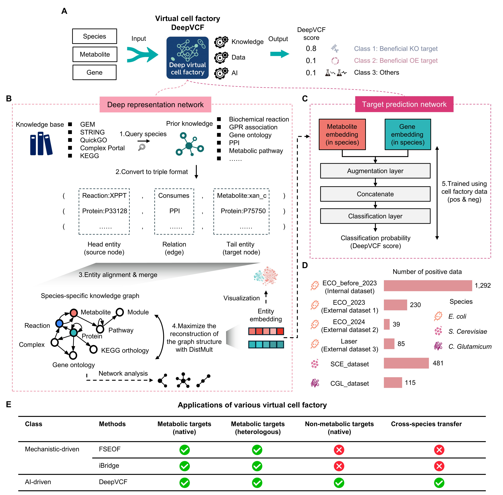

# Cell factory design integrating knowledge graphs with deep learning
This repo contains a PyTorch implementation for DeepME, which is model proposed in our paper **"Cell factory design integrating knowledge graphs with deep learning"**.


## Brief Introduction
Deep Learning for Metabolic Engineering (DeepME) is a novel data-driven framework that **integrates metabolic and functional knowledge graphs with deep representation learning** to systematically predict genome-wide engineering targets. DeepME captures system-level gene-metabolite associations, achieves state-of-the-art (SOTA) performance in identifying metabolic genes with improved capacity to discover distal targets, generalizes to non-metabolic and heterologous genes with greater engineering potential, and supports zero- and few-shot learning via transfer learning.



## Requirements
To run our code, following main dependency packages are needed:
```
python         3.8
torch          2.4.0
tqdm           4.66.5
numpy          1.24.4
pandas         2.1.1
scikit-learn   1.3.2
matplotlib     3.7.5
```


## Data & Code
We provide necessary data and code for running DeepME in following structure:
```
.
├── code
│   ├── data_utils.py
│   ├── metric.py
│   ├── model.py
│   ├── __pycache__
│   ├── sampling.py
│   ├── trainer.py
│   └── utils.py
├── data
│   ├── KG
│   ├── me_data
│   └── other_data
├── fig
│   └── figure1.jpg
├── pred
├── README.md
├── script
│   ├── embedding_benchmark.py
│   ├── finetune_tpn.py
│   ├── pred.py
│   ├── pretrain_tpn.py
│   ├── test_tpn.py
│   ├── train_kge.py
│   └── train_tpn.py
└── trained_model
    ├── ECO-KG_ECO-Pre-2023
    ├── ECO-KG-hetero_ECO-Pre-2023
    ├── embedding_benchmark
    └── UNI-KG_ECO-Pre-2023
```


## How to use DeepME
```
# To make target prediction using trained DeepME using dataset, please run the following script
python script/pred.py
```
```
# To funetune trained DeepME, please run the following script
python script/finetune_tpn.py
```

```
# To train new DeepME from scarch, please run the following script
python script/train_kge.py # knowledge graph embedding
#python script/pretrain_tpn.py # if data augmentation strategy is used
python script/train_tpn.py # training target prediction network
```
1.Modify the hyperparameters in the relevant files as needed.


## How to evaluate DeepME
```
# To benchmark embedding, please run the following script
python script/embedding_benchmark.py
```
```
# To evaluate trained DeepME based on curacted dataset, please run the following script
python script/test_tpn.py
```
1.If any new dataset is used for evaluation, please place the file in the data/me_data/new_folder/ directory (ensure the format is consistent with existing files). Then, add the corresponding entry in load_file_path() in code/utils.py.
2.Modify the hyperparameters in the relevant files as needed.

## Reproduce
```
# To reproduce external dataset ECO_2023_metabolic, please run the following script:
python script/test_tpn.py
```
We get report:
{'auroc': 0.8865737337749375, 'auprc': 0.5968157164588611, 'accuracy': 0.8862144420131292, 'precision': 0.7303370786516854, 'recall': 0.3299492385786802, 'f1_score': 0.45454545454545453, 'mcc': 0.4406539332428559}

## Contact
If any files is needed or something wrong with the code, please contact leafaeolian@gmail.com.
