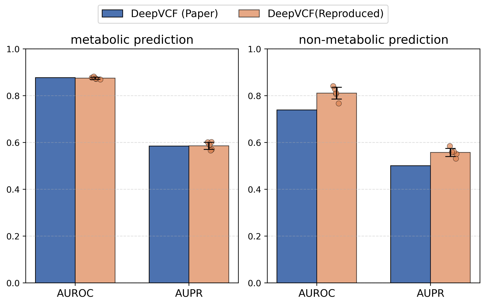

# AI virtual cell factories for enhanced and genome-wide target prediction
This repo contains a reconstructed verison for DeepVCF, which is model proposed in our paper **"AI virtual cell factories for enhanced and genome-wide target prediction"**.


[see Old version](https://github.com/Leafaeolian/DeepME/tree/main)


## Brief Introduction
DeepVCF is AI-driven framework that integrates comprehensive biological knowledge with experimental data to predict engineering targets at a genome-wide scale. By learning system-level relationships between genes and metabolites, DeepVCF extends the scope of traditional metabolic modelling and enables accurate identification of both metabolic and non-metabolic targets. Note DeepME is old name.


## Requirements
To run DeepVCF, following main dependency packages are needed:
```
python         3.8
torch          2.4.0
tqdm           4.66.5
numpy          1.24.4
pandas         2.1.1
scikit-learn   1.3.2
matplotlib     3.7.5
```


## Data & Code
We provide necessary data and code for running DeepVCF in following structure:
```
.
├── code
│   └── __pycache__
├── data
│   ├── KG
│   │   ├── ALL
│   │   ├── CGL
│   │   ├── ECO
│   │   └── SCE
│   ├── me_data
│   │   ├── cross_species_transfer
│   │   │   ├── cgl
│   │   │   └── sce
│   │   ├── dataset
│   │   ├── ffa
│   │   ├── metabolic_gene
│   │   ├── non_metabolic_gene
│   │   └── train_data
│   │       └── embedding_benchmark
│   │           ├── amino_acid_hold_out
│   │           ├── carbohydrate_hold_out
│   │           ├── cofactors_and_vitamins_hold_out
│   │           ├── gene_hold_out_1
│   │           ├── gene_hold_out_2
│   │           ├── lipid_hold_out
│   │           ├── metabolite_hold_out
│   │           ├── nucleotide_hold_out
│   │           ├── random
│   │           ├── random_rev
│   │           └── secondary_metabolites_hold_out
│   └── other_data
├── fig
├── script
└── trained_model

```
see our paper for details.


## To train new DeepVCF from scarch, please run the following script
```
# Modify the hyperparameters if needed.
python script/train_deepvcf.py
```

## Reproduce
For easily reproduce, we reconstruct the code. This version largely reproduce our paper results (see script/example.ipynb).



## Using DeepVCF for real-world genome-scale target prediction
see script/example.ipynb for more details.


🔔 NOTE: 
```
1.DeepVCF might cause confusion in practical applications by simultaneously prioritizing KO and OE of same gene. (For example, rank one in the top 10, and rank the other in the top 50.)
```

## To do list
- [ ] Add more species KG.
- [ ] Integrate automated text-mining pipeline.
- [ ] Add active learning part.
- [ ] Refine algorithms.


## Coopration
We welcome co-operation on cell factory design alghrithm develepment and real-world applications. If you have any questions or suggestions, please feel free to contact us.


## Contact
nsk25@mails.tsinghua.edu.cn.
